### Paso 1: Conectarse al servidor

Para conectarse al servidor usaremos  `ssh`. Si introduces el siguiente comando pasaremos la clave publica que hemos creado al servidor y nos conectaremos a el.

    ssh -i "gotzon.pem" ubuntu@ec2-3-82-194-142.compute-1.amazonaws.com

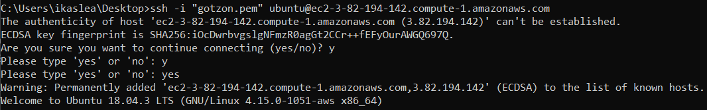

### Paso 2: Instalar Apache
Una vez dentro del servidor instalaremos apache para eso introduce el siguiente codigo en el terminal.

    sudo apt-get update

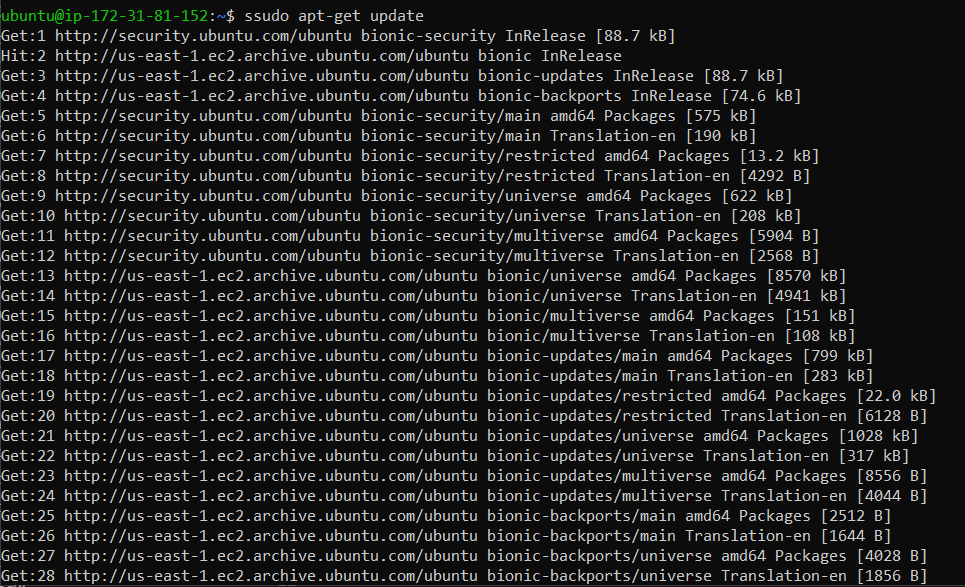
Con ese comando actualizaremos todo el servidor una vez hecho eso meteremos el siguiente comando

    sudo apt-get install apache2
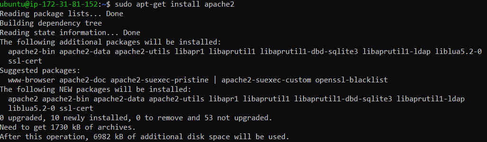

### Paso 3: Instalar MySQL

Ahora que tienes tu servidor web activo y funcional, es el momento de instalar MySQL. MySQL es un sistema de administración de bases de datos. Basicamente, él organizará y proveerá acceso a las bases de datos donde tu sitio podrá guardar información.

Tenemos que meter el siguiente comando para instalar `MySQL` en el servidor.

    sudo apt install mysql-server

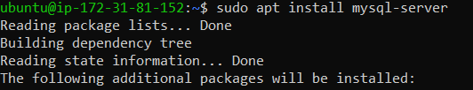

Cuando la instalación esté completa, debes ejecutar un archivo de comandos de seguridad que viene preinstalado con MySQL, éste removerá algunos parámetros peligrosos, así como asegurará el acceso a tu base de datos. Ejecuta el archivo interactivo de comandos mediante:

    sudo mysql_secure_installation

Lo primero qu nos va ha preguntar sera si queremos cambiar la contraseña y poner el nivel de contraseña. Ponemos el nivel 2 e introducimos la contraseña que queramos con los requisitos que hemos puesto.

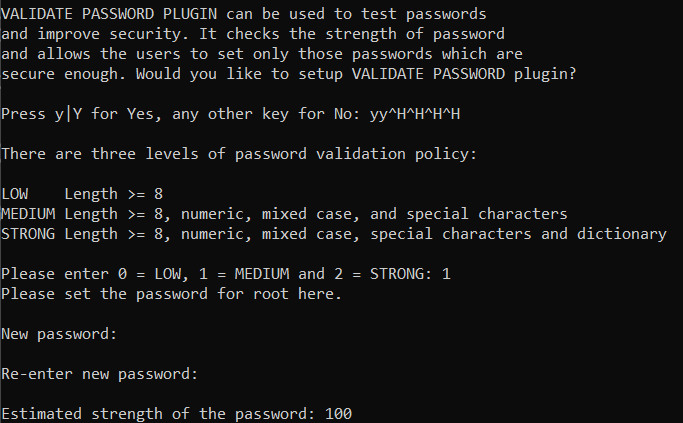

Luego nos preguntara más cosas pon si siquieres insertarlos a MySQL.

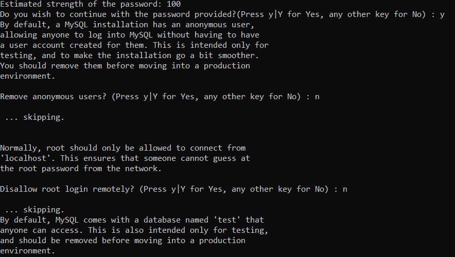

### Paso 4: Instalar PHP

El siguiente paso es instalar `PHP`.Una vez más usaremos el sistema apt para instalar PHP. Adicionalmente lo podemos configurar para que se ejecute sobre el servidor Apache y para que se comunique con la base de datos MySQL:

    sudo apt install php libapache2-mod-php php-mysql

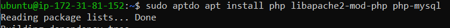

Ahora meteremos el siguiente comando para cambiar el orden del `index.php`.

    sudo nano /etc/apache2/mods-enabled/dir.conf

Nos saldra lo siguiente:

    <IfModule mod_dir.c>
    DirectoryIndex index.html index.cgi index.pl index.php index.xhtml index.htm
    </IfModule>

Ahora pon el index.php el primero.

    <IfModule mod_dir.c>
    DirectoryIndex index.php index.html index.cgi index.pl index.xhtml index.htm
    </IfModule>

### Paso 5: IP Elastica

Para asignar una dirección IP elástica desde un grupo de direcciones IPv4 públicas de Amazon utilizando la consola:

* Abra la consola de Amazon EC2 en https:// console.aws.amazon.com/ec2/.

* En el panel de navegación, elija Elastic IPs (Direcciones IP elásticas).

    

* Elija Allocate new address (Asignar nueva dirección).

    

* En IPv4 address pool (Grupo de direcciones IPv4), elija Amazon pool (Grupo de Amazon).

    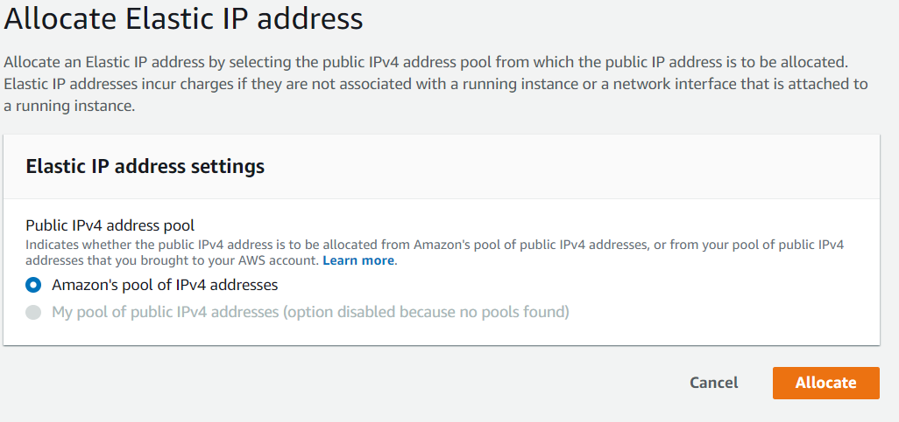

* Elija Allocate (Asignar) y cierre la pantalla de confirmación.

    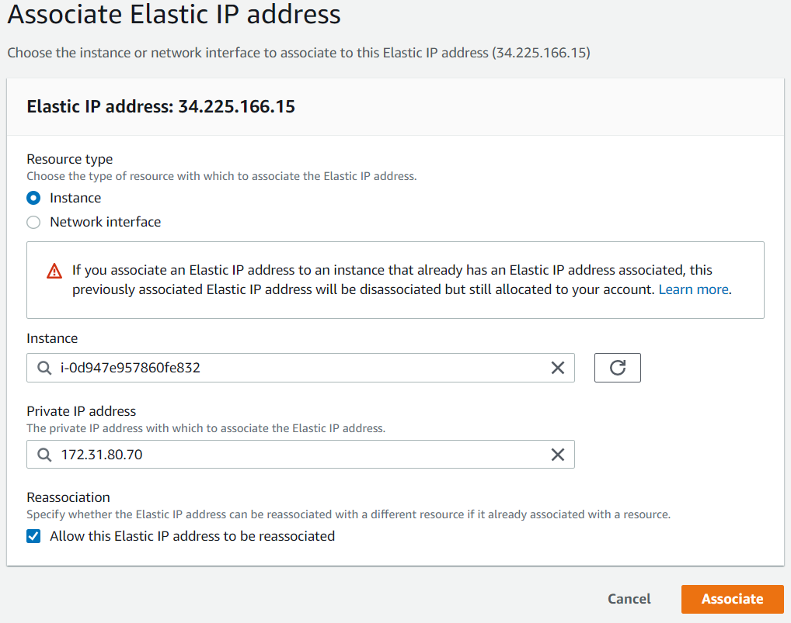

### Paso 6: Gestión de DNS

* A = Dirección (address). Este registro se usa para traducir nombres de servidores de alojamiento a direcciones IPv4.

* AAAA = Dirección (address). Este registro se usa en IPv6 para traducir nombres de hosts a direcciones IPv6.

* CNAME = Nombre canónico (canonical Name). Se usa para crear nombres de servidores de alojamiento adicionales, o alias, para los servidores de alojamiento de un dominio. Es usado cuando se están corriendo múltiples servicios (como FTP y servidor web) en un servidor con una sola dirección IP. Cada servicio tiene su propia entrada de DNS (como ftp.ejemplo.com. y www.ejemplo.com.). Esto también es usado cuando corres múltiples servidores HTTP, con diferentes nombres, sobre el mismo host. Se escribe primero el alias y luego el nombre real. Ej. Ejemplo1 IN CNAME ejemplo2

* SRV = Service record (SRV record).

* TXT = Un registro TXT es un tipo de registro DNS que proporciona información de texto a fuentes externas a tu dominio.El texto puede ser lenguaje legible por máquina o por el ser humano, y se puede utilizar para diversos fines.

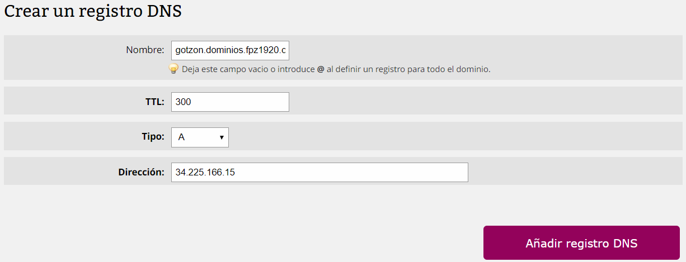

### Paso 7: Virtual Hosts

Primero vamos a crear los subdominios a las cuales les llamaremos:

* cliente-tunombre.dominios.fpz1920.com--> a tu IP Elástica
* servidor-tunombre.dominios.fpz1920.com--> a tu IP Elástica

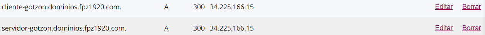

Lo siguiente es crear dos carpetas en `var/www/` que se llamaran cliente y servidor. Lo primero es ir a la carpeta www para eso meteremos el siguiente comando.

    cd var/www/

Una vez dendro introduciremos el siguiente comando para crear las carpetas.

    sudo mkdir cliente
    sudo mkdir servidor

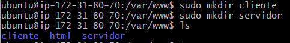

El siguiente paso es crear un `Index.html` en cada carpeta, para ello meteremos el siguiente codigo cuando estemos dentro de la carpeta.

    sudo nano Index.html

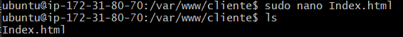

Dentro de la carpeta cliente escribiremos lo siguiente:

    <h1>Hola! soy el CLIENTE :D</h1>
    
¡Todo lo que pido me lo dan!

Y en la carpeta servidor:

    <h1>Hola! soy el SERVIDOR :'(</h1>
    
¡Siempre trabajando para que otros se lleven el mérito!

Ahora vamos a ir a la carpeta sites-avaiable en la cual tendremos que crear una configuracion para que redirija a nuestra carpeta. Para ello meteremos el siguiente codigo.

    cd etc/apache2/sites-available/

Una vez dentro copiaremos una configuracion que este y lo cambiaremos.

     sudo cp 000-default.conf cliente.conf

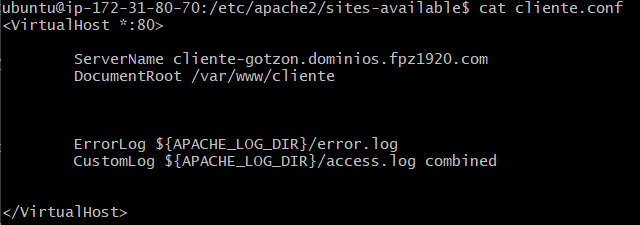
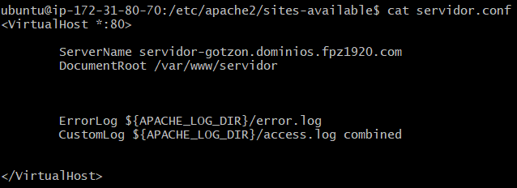

Una vez escrito eso dentro de la configuracion meteremos el siguiente comando para validarlo.

    sudo a2ensite cliente.conf
    sudo a2ensite servidor.conf

Y por lo ultimo sera resetear apache.

    sudo service apache2 restart

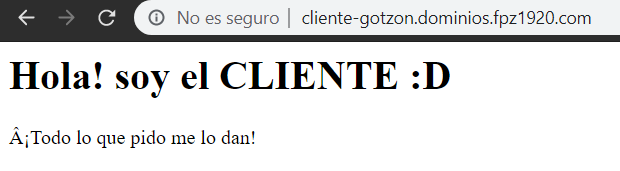
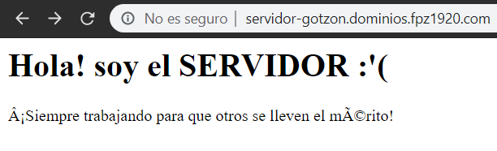

### Paso 8: Servidor FTP

Primero vamos a crear 3 usuarios cliente, servidor y administrador para eso meteromos el siguiente comando.

    sudo adduser cliente

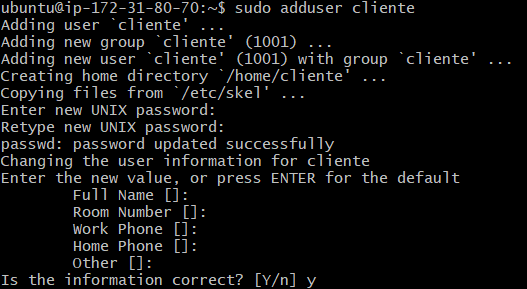

    sudo adduser servidor

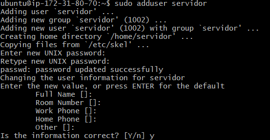

    sudo adduser administrador

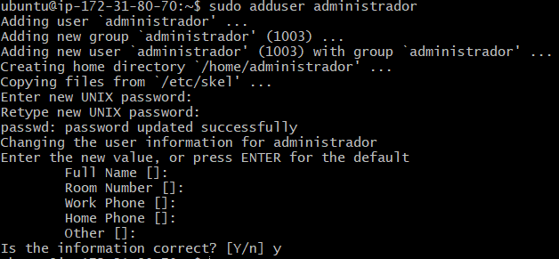

Ahora instalaremos el servidor FTP, para ello meteremos el siguiente comando:

    sudo apt-get install vsftpd

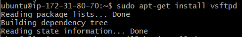

Una vez que haya instalado el paquete, puede ejecutar el servicio y habilitarlo para que se ejecute al iniciar el sistema.

    sudo systemctl start vsftpd
    sudo systemctl enable vsftpd

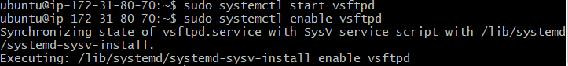

Ahora habilitaremos el puerto 21 para el servicio FTP

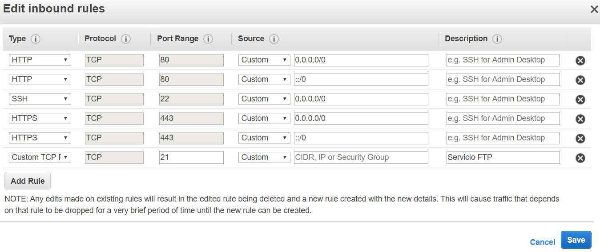

Por lo ultimo reseteamos el servicio FTP con el sigiente comando:

    sudo service vsftpd restart

    
### Paso 8: Crear copias de seguridad mediante comandos

Para empezar buscaremos los directorios creados anteriormente de cliente y servidor.Cuando los tengamos los comprimiremos. Estos son los comando que mas se utilizan

* Archivos .tar: Empaquetar: tar -cvf paquete.tar /dir/a/comprimir/ Desempaquetar: tar -xvf paquete.tar

* Archivos .gz: Comprimir: gzip -9 index.php Descomprimir: gzip -d index.php.gz

* Archivos .zip: Comprimir: zip archivo.zip carpeta Descomprimir: unzip archivo.zip

Ahora vamos a comprimir los directorios cliente y servidor con los siguientes comandos:

    sudo tar -cvzf cliente.tgz /var/www/cliente/

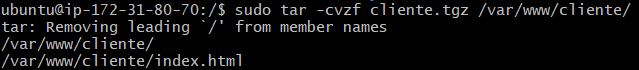

    sudo tar -cvzf servidor.tgz /var/www/servidor/

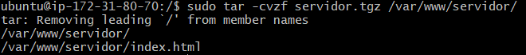

Comprobacion:

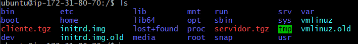

### Paso 9: Automatizar copias de seguridad

Lo primero es crear el script. Este script creara copias de seguridad de la base de datos y las carpetas comprimidas. Para empezar meteremos el siguiente comando:

    sudo nano scriptCopia.sh

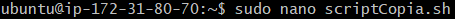

Dentro del script escribiremos lo siguiente:

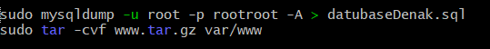

El siguiente paso es darle permisos al script, para ello meteremos el siguiente comando.

    sudo chmod 700 scriptCopia.sh

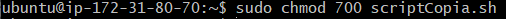

Ahora comprobaremos el script. Mete el siguiente comando.

    sudo ./scriptCopia.sh
    
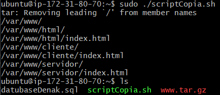

Una vez que funciona haremos lo mismo con el cliente.

    sudo nano scriptCopiaCliente.sh 

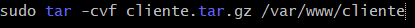

Y le damos permisos.

    sudo chmod 700 scriptCopiaCliente.sh

Y lo comprobamos.

    sudo ./scriptCopiaCliente.sh

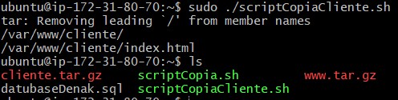

El siguiente paso es automatizar los script que hemos creado anteriormente. Para ello meteremos el siguiente comando. Y dentro escribiremos lo siguiente.

    sudo nano crontab

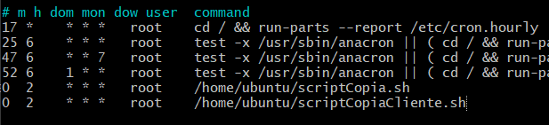

El ultimo paso es crear otro script para borrar automaticamente las copias de seguridad que se esten almacenando.

    sudo nano borrar.sh

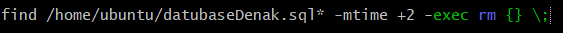

hau eginda bi egunero ezabatuko ditu.